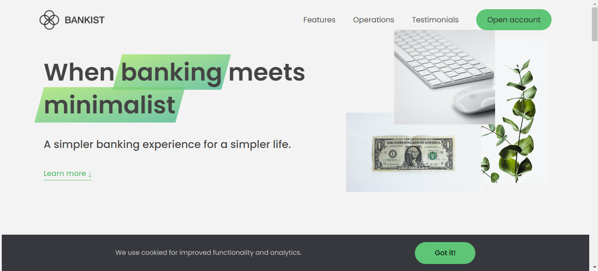
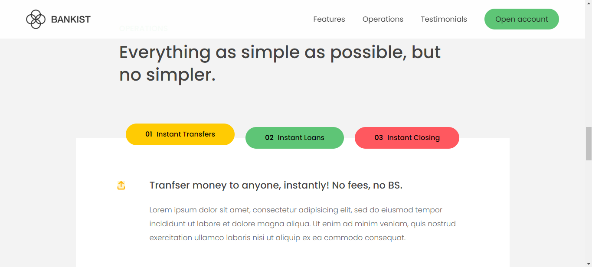
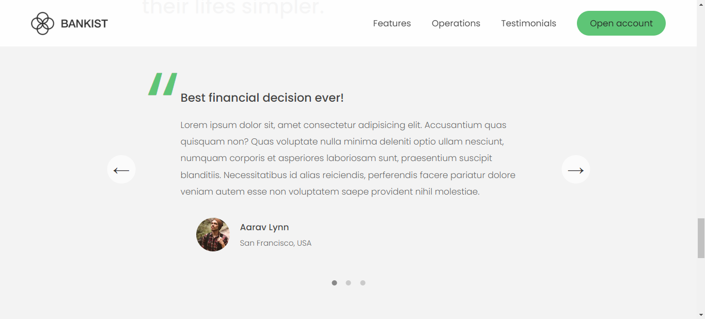

# Bankist-App-Advanced-DOM :

## 💨 Proje Hakkında :
* Bu projede öğrenmiş olduğum 'Gelişmiş DOM Eventleri' ni kullanarak bir banka sayfasını 'The Complate JS Course - Jonas Schmedthmann' ile beraber oluşturdum.
* Projenin canlı versiyonuna linkten erişebilirsiniz ➡ <a>https://bankist-app-dom.vercel.app/</a>

## ⚡ Projemde barındırdığım dinamik JS etkileşimleri :
* Event delegation kullanılarak "Menu Fade Animation" ve Intersection Observer kullanılarak oluşturulmuş sticky navbar.
* Tıklamada "Smooth Scroll" event.
* Scroll event yerine daha iyi performans için "Intersection observer API" kullanarak oluşturulmuş "Revealing Sections".
* Basit "Cookie" elementi.
* Daha iyi performans için "Lazy image" load efekti.
* Event delegation yöntemi kullanılarak oluşturulmuş "Tab Component".
* "Slider".
* CSS kullanılarak oluşturulmuş "Modal" yapısı.
## 🛠 Uygulamayı oluştururken kullandığım teknolojiler :
* 
* 
* 
## 💻 Projenin kurulumu :
* Projenin kurulumu için herhangi bir API veya Bundler gerekmemektedir.
## :phone: İletişim
 

   
<b> <samp> İletişime Geçin </samp></b>

    
   <samp>
   <b><h2 style="color: #fc6203">KADIR&nbsp;KARABACAK </h2></b>
   
      
     Projenin Linki: <a href="https://github.com/KadirKarabacak/Bankist-App-Dom">Bankist App Advanced DOM</a>
      
      
     LinkedIn: <a href="https://www.linkedin.com/in/kadir-karabacak-/"> LinkedIn Hesabım</a>
      
     Instagram: <a href="https://www.instagram.com/kadir_krbck_/"> Instagram Hesabım</a>
      
     Mail Adresim: <a href="#"> kadirht@hotmail.com</a>
   </samp>
 

